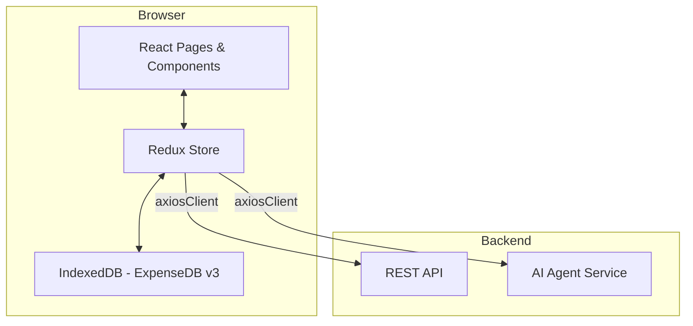

# Design Document: Money Mind Upgrade

## Overview

This upgrade extends the existing Money Mind React/TypeScript/Redux Toolkit application with six major feature areas: bank statement upload (enhanced), transaction annotation, transaction grouping, debt management, savings goals, budget management, analytics, and an AI agentic workflow layer.

The design follows the existing patterns strictly:

- Redux Toolkit slices with `createAsyncThunk` for all server interactions
- Optimistic updates in reducers with rollback on failure
- IndexedDB via the `idb` library for offline queuing (extending `ExpenseDB`)
- MUI v6 components for all UI
- `axiosClient` with the existing interceptor chain for all HTTP calls
- `recharts` (already installed) for all charts
- `react-hook-form` (already installed) for complex forms

The existing routes `/budget` and `/analytics` are stubs — they will be promoted to full pages. `/goals` and `/debts` are existing components that will be refactored into proper page components with Redux-backed state.

---

## Architecture



### State Flow

All mutations follow this pattern (matching the existing `updateTransaction` / `syncTransactions` pattern):

1. Dispatch action → optimistic update applied to Redux store immediately
2. `createAsyncThunk` fires HTTP request
3. On success: reconcile store with server response
4. On failure: revert store to pre-action snapshot, show snackbar error

Offline annotation edits continue to use IndexedDB queuing (existing pattern in `transactionStore.ts`). New offline-capable stores will be added for groups, debts, goals, and budgets.

---

## Components and Interfaces

### New Pages (promoted from stubs)

| Route           | Component                                        | Description                           |
| --------------- | ------------------------------------------------ | ------------------------------------- |
| `/transactions` | `TransactionLogs` (existing, extended)           | Add grouping UI, AI suggestions panel |
| `/debts`        | `pages/Debts.tsx` (new page, replaces component) | Full debt management with EMI planner |
| `/goals`        | `pages/Goals.tsx` (new page, replaces component) | Goals with contributions and progress |
| `/budget`       | `pages/Budget.tsx` (new page)                    | Monthly budget management             |
| `/analytics`    | `pages/Analytics.tsx` (new page)                 | Charts and summaries                  |
| `/ai-chat`      | `pages/AIChat.tsx` (new page)                    | Conversational AI interface           |

### New Components

```
src/components/
  statement/
    StatementUpload.tsx        # File picker + bank name prompt + preview dialog
    StatementPreviewTable.tsx  # Editable preview of parsed rows with duplicate flags
  transactions/
    TransactionGroupBadge.tsx  # Visual badge on grouped transactions in the table
    GroupDetailDrawer.tsx      # Slide-in drawer showing group members + Group_Balance
    CreateGroupModal.tsx       # Modal to name and confirm a new group from selection
    AIAnnotationSuggestion.tsx # Inline suggestion chip (accept/reject) on annotation panel
    AIGroupSuggestion.tsx      # Banner suggesting related transactions to group
  debt/
    DebtCard.tsx               # Summary card per debt (used in list + dashboard)
    EMIPaymentModal.tsx        # Record EMI / part-payment against a debt
    DebtPayoffPlanner.tsx      # Projected payoff timeline chart
    AIDebtStrategy.tsx         # AI avalanche/snowball recommendation panel
  goals/
    GoalCard.tsx               # Progress card per goal
    ContributionModal.tsx      # Record a contribution toward a goal
    AIGoalSuggestion.tsx       # AI monthly contribution suggestion
  budget/
    BudgetCard.tsx             # Per-category budget card with progress bar
    BudgetFormModal.tsx        # Create/edit budget modal
    AIBudgetSuggestion.tsx     # AI over-budget warning + suggestion
  analytics/
    IncomeExpenseChart.tsx     # Monthly bar chart (recharts BarChart)
    CategoryPieChart.tsx       # Category donut chart (recharts PieChart)
    NetSavingsChart.tsx        # Net savings line chart (recharts LineChart)
    DebtProgressChart.tsx      # Debt remaining balance over time (recharts LineChart)
    GoalsSummaryChart.tsx      # Goals progress bar chart (recharts BarChart)
  ai/
    AIChatPanel.tsx            # Conversational chat UI (floating panel or full page)
    AIFeedbackButtons.tsx      # Accept/Reject buttons for any AI suggestion
  dashboard/
    SummaryCard.tsx            # Reusable stat card (replaces hardcoded cards in Dashboard)
    EMIReminderBanner.tsx      # Dashboard banner for upcoming EMI within 5 days
    BudgetWarningBanner.tsx    # Dashboard banner for 80%+ budget categories
```

### Sidebar Update

Add `/ai-chat` nav item to `Sidebar.tsx`:

```tsx
{ label: "AI Assistant", icon: <SmartToy />, path: "/ai-chat" }
```

---

## Data Models

All TypeScript interfaces are defined in `src/types/` (new directory) and imported by slices and components.

### Transaction (extended)

```typescript
// src/types/transaction.ts
export interface ITransaction {
    _id: string;
    transactionDate: string;
    narration: string;
    notes: string;
    category: string;
    label: string[];
    amount: string;
    bankName: string;
    isCredit: boolean;
    isCash: boolean;
    groupId?: string | null; // NEW: reference to TransactionGroup
    debtId?: string | null; // NEW: linked debt (EMI payment)
    goalId?: string | null; // NEW: linked goal (contribution)
    aiSuggestedCategory?: string; // NEW: AI suggestion
    aiSuggestedLabels?: string[]; // NEW: AI suggestion
    aiSuggestionAccepted?: boolean; // NEW: user feedback
}
```

### TransactionGroup

```typescript
// src/types/transactionGroup.ts
export interface ITransactionGroup {
    _id: string;
    name: string;
    transactionIds: string[];
    groupBalance: number; // credits - debits, computed client-side and stored
    isSettled: boolean; // groupBalance === 0
    createdAt: string;
    updatedAt: string;
}

export interface ITransactionGroupDetail extends ITransactionGroup {
    transactions: ITransaction[]; // populated on fetch
}
```

### Debt

```typescript
// src/types/debt.ts
export type DebtStatus = "ACTIVE" | "PAID_OFF" | "PAUSED";

export interface IDebt {
    _id: string;
    debtName: string;
    lender: string;
    principal: number;
    interestRate: number; // annual percentage
    startDate: string;
    expectedEndDate: string;
    monthlyExpectedEMI: number;
    remainingBalance: number;
    totalInterestPayable: number; // computed: stored for display
    nextPaymentDate: string;
    status: DebtStatus;
    linkedTransactionIds: string[];
    createdAt: string;
    updatedAt: string;
}

export interface IEMIPayment {
    _id: string;
    debtId: string;
    amount: number;
    paymentDate: string;
    isPartPayment: boolean;
    transactionId?: string;
}
```

### Goal

```typescript
// src/types/goal.ts
export interface IGoal {
    _id: string;
    name: string;
    targetAmount: number;
    currentSavedAmount: number;
    deadline?: string;
    description?: string;
    isAchieved: boolean;
    linkedTransactionIds: string[];
    createdAt: string;
    updatedAt: string;
}

export interface IGoalContribution {
    _id: string;
    goalId: string;
    amount: number;
    date: string;
    transactionId?: string;
}
```

### Budget

```typescript
// src/types/budget.ts
export interface IBudget {
    _id: string;
    category: string;
    limitAmount: number;
    month: number; // 1-12
    year: number;
    spentAmount: number; // computed from transactions, stored for caching
    createdAt: string;
    updatedAt: string;
}
```

### AI Types

```typescript
// src/types/ai.ts
export interface IAISuggestion {
    transactionId: string;
    suggestedCategory: string;
    suggestedLabels: string[];
    confidence: number; // 0-1
    accepted?: boolean;
}

export interface IAIGroupSuggestion {
    transactionIds: string[];
    suggestedName: string;
    confidence: number;
    dismissed?: boolean;
}

export interface IAIDebtStrategy {
    method: "avalanche" | "snowball";
    orderedDebtIds: string[];
    projectedPayoffDate: string;
    rationale: string;
}

export interface IAIChatMessage {
    role: "user" | "assistant";
    content: string;
    timestamp: string;
}
```

### IndexedDB Schema (v3)

Extends `ExpenseDB` in `src/helpers/indexDB/db.ts`:

```typescript
interface ExpenseDB extends DBSchema {
    edited_transactions: { key: string; value: Partial<ITransaction> };
    labels: { key: string; value: { key: string; labels: string[] } };
    // NEW stores:
    pending_groups: { key: string; value: Partial<ITransactionGroup> };
    pending_debts: { key: string; value: Partial<IDebt> };
    pending_goals: { key: string; value: Partial<IGoal> };
    pending_budgets: { key: string; value: Partial<IBudget> };
}
// DB version bumped from 2 → 3
```

---

## Redux Store Design

### New Slices

```
src/store/
  transactionGroupSlice.ts
  debtSlice.ts
  goalSlice.ts
  budgetSlice.ts
  analyticsSlice.ts
  aiSlice.ts
```

Updated `src/store/index.ts`:

```typescript
import transactionGroupReducer from "./transactionGroupSlice";
import debtReducer from "./debtSlice";
import goalReducer from "./goalSlice";
import budgetReducer from "./budgetSlice";
import analyticsReducer from "./analyticsSlice";
import aiReducer from "./aiSlice";

export const store = configureStore({
    reducer: {
        auth: authReducer,
        transactions: transactionReducer,
        transactionGroups: transactionGroupReducer,
        debts: debtReducer,
        goals: goalReducer,
        budgets: budgetReducer,
        analytics: analyticsReducer,
        ai: aiReducer,
    },
});
```

### Slice Shapes

**transactionGroupSlice**

```typescript
interface TransactionGroupState {
    groups: ITransactionGroup[];
    loading: boolean;
    error: string | null;
    aiGroupSuggestions: IAIGroupSuggestion[];
}
// Thunks: listGroups, createGroup, addToGroup, removeFromGroup, dissolveGroup
// Reducers: optimisticCreateGroup, revertGroup
```

**debtSlice**

```typescript
interface DebtState {
    debts: IDebt[];
    emiPayments: IEMIPayment[];
    loading: boolean;
    error: string | null;
    aiStrategy: IAIDebtStrategy | null;
}
// Thunks: listDebts, createDebt, updateDebt, deleteDebt, recordEMIPayment, fetchAIDebtStrategy
```

**goalSlice**

```typescript
interface GoalState {
    goals: IGoal[];
    contributions: IGoalContribution[];
    loading: boolean;
    error: string | null;
}
// Thunks: listGoals, createGoal, updateGoal, deleteGoal, recordContribution
```

**budgetSlice**

```typescript
interface BudgetState {
    budgets: IBudget[];
    loading: boolean;
    error: string | null;
}
// Thunks: listBudgets, createBudget, updateBudget, deleteBudget, copyBudgetsFromMonth
```

**analyticsSlice**

```typescript
interface AnalyticsState {
    monthlyIncomeExpense: { month: string; income: number; expense: number }[];
    categoryBreakdown: { category: string; amount: number }[];
    netSavingsTrend: { month: string; netSavings: number }[];
    loading: boolean;
    error: string | null;
    filters: { dateFrom: string; dateTo: string; bankName: string };
}
// Thunks: fetchAnalytics (single thunk, parameterized by filters)
```

**aiSlice**

```typescript
interface AIState {
    annotationSuggestions: IAISuggestion[];
    groupSuggestions: IAIGroupSuggestion[];
    debtStrategy: IAIDebtStrategy | null;
    chatHistory: IAIChatMessage[];
    loading: boolean;
    error: string | null;
}
// Thunks: fetchAnnotationSuggestions, fetchGroupSuggestions, fetchDebtStrategy,
//         fetchGoalSuggestion, fetchBudgetSuggestions, sendChatMessage
// Reducers: acceptSuggestion, rejectSuggestion, dismissGroupSuggestion
```

---

## API Service Layer

New service files follow the same pattern as `authService.ts` — thin wrappers over `axiosClient`:

```
src/services/
  transactionGroupService.ts   # CRUD for /transaction-groups/*
  debtService.ts               # CRUD for /debt/* + /debt/emi-payments/*
  goalService.ts               # CRUD for /goals/* + /goals/contributions/*
  budgetService.ts             # CRUD for /budgets/*
  analyticsService.ts          # GET /analytics/summary (parameterized)
  aiService.ts                 # POST /ai/annotate, /ai/group-suggest,
                               #      /ai/debt-strategy, /ai/goal-suggest,
                               #      /ai/budget-suggest, /ai/chat
  statementService.ts          # POST /transaction-logs/upload-data-from-file (existing, wrapped)
```

All thunks call these service functions rather than calling `axiosClient` directly, keeping slices clean.

---

## Key Algorithms

### Group_Balance Calculation

```typescript
// Pure function — no side effects, used in slice and UI
function calculateGroupBalance(transactions: ITransaction[]): number {
    return transactions.reduce((acc, tx) => {
        const amount = parseFloat(tx.amount) || 0;
        return tx.isCredit ? acc + amount : acc - amount;
    }, 0);
}
```

### EMI Calculation (Reducing Balance Method)

```typescript
// P = principal, r = monthly rate (annualRate/12/100), n = tenure months
function calculateEMI(principal: number, annualRate: number, tenureMonths: number): number {
    if (annualRate === 0) return principal / tenureMonths;
    const r = annualRate / 12 / 100;
    return (principal * r * Math.pow(1 + r, tenureMonths)) / (Math.pow(1 + r, tenureMonths) - 1);
}

function calculateTotalInterest(principal: number, emi: number, tenureMonths: number): number {
    return emi * tenureMonths - principal;
}
```

### Projected Payoff Date (with part-payments)

```typescript
function projectedPayoffDate(remainingBalance: number, monthlyEMI: number, annualRate: number, fromDate: Date): Date {
    const r = annualRate / 12 / 100;
    let balance = remainingBalance;
    let months = 0;
    while (balance > 0 && months < 600) {
        // 600 = 50yr safety cap
        const interest = balance * r;
        const principal = monthlyEMI - interest;
        if (principal <= 0) break; // EMI too low to cover interest
        balance -= principal;
        months++;
    }
    const result = new Date(fromDate);
    result.setMonth(result.getMonth() + months);
    return result;
}
```

### Budget Spend Calculation

Computed client-side from the Redux `transactions` state — no separate API call needed for display:

```typescript
function calculateSpentForBudget(transactions: ITransaction[], category: string, month: number, year: number): number {
    return transactions
        .filter((tx) => {
            const d = dayjs(tx.transactionDate);
            return !tx.isCredit && tx.category === category && d.month() + 1 === month && d.year() === year;
        })
        .reduce((sum, tx) => sum + (parseFloat(tx.amount) || 0), 0);
}
```

### AI Debt Payoff Strategy

The frontend sends debt data to the AI service endpoint. The strategy logic (avalanche vs snowball) is computed server-side by the AI agent. The frontend renders the ordered list and rationale returned by the API.

---

## Statement Upload Flow (Enhanced)

The existing `handleFileUpload` in `TransactionControls.tsx` already parses XLS/XLSX via `xlsx`. The upgrade adds:

1. PDF support: detect `file.type === "application/pdf"` and call a backend parse endpoint (`POST /transaction-logs/parse-pdf`) since PDF parsing requires server-side processing.
2. Bank name prompt: already partially implemented (`bankName` state). Formalize into a required step before file selection is accepted.
3. Duplicate detection: after parsing, call `POST /transaction-logs/check-duplicates` with the parsed rows; backend returns a set of duplicate `_id`s which are flagged in `StatementPreviewTable`.
4. AI annotation on import: after confirmed import, dispatch `fetchAnnotationSuggestions` with the new transaction IDs.

---

## Routing Changes

```typescript
// App.tsx additions
{
  path: "debts",
  element: <DebtsPage />,          // new page component
},
{
  path: "goals",
  element: <GoalsPage />,          // new page component
},
{
  path: "budget",
  element: <BudgetPage />,         // was stub
},
{
  path: "analytics",
  element: <AnalyticsPage />,      // was stub
},
{
  path: "ai-chat",
  element: <AIChatPage />,         // new
},
```

---

## Correctness Properties

_A property is a characteristic or behavior that should hold true across all valid executions of a system — essentially, a formal statement about what the system should do. Properties serve as the bridge between human-readable specifications and machine-verifiable correctness guarantees._

### Property 1: Statement parsing extracts all rows

_For any_ valid statement file content with N data rows, parsing it should produce exactly N transaction records (no rows silently dropped or duplicated).

**Validates: Requirements 1.3**

### Property 2: Bank name association invariant

_For any_ parsed statement and any bank name supplied by the user, every transaction in the resulting set should have `bankName` equal to the supplied bank name.

**Validates: Requirements 1.4**

### Property 3: Malformed file produces no imports

_For any_ file input that is malformed or in an unsupported format, the transaction list in the store should remain identical to its state before the upload attempt.

**Validates: Requirements 1.7**

### Property 4: Duplicate transactions are flagged

_For any_ transaction that already exists in the database (same date, narration, amount, and bank), it should appear with a duplicate flag in the preview table.

**Validates: Requirements 1.8**

### Property 5: Bank filter isolation

_For any_ two distinct bank names A and B, filtering transactions by bank A should return zero transactions with `bankName === B`, and vice versa.

**Validates: Requirements 1.9, 1.10**

### Property 6: Annotation round-trip

_For any_ transaction and any annotation (note, category, labels), saving the annotation should result in the transaction in the Redux store having exactly those annotation values, and querying the backend should return the same values.

**Validates: Requirements 2.2, 2.4, 2.5, 2.6**

### Property 7: Filter returns only matching transactions

_For any_ filter combination (category, label, date range, bank), every transaction returned by the filter should satisfy all selected filter predicates, and no transaction that fails any predicate should appear in the results.

**Validates: Requirements 2.7**

### Property 8: Optimistic annotation update

_For any_ annotation change dispatched to the store, the Redux state should reflect the new annotation values before the server response is received, and the change should be present in IndexedDB during the pending period.

**Validates: Requirements 2.8, 3.3**

### Property 9: Sync cleanup round-trip

_For any_ set of annotation changes queued in IndexedDB, after a successful sync the IndexedDB store should contain zero pending edits for those transactions.

**Validates: Requirements 2.9**

### Property 10: Sync failure retains queue

_For any_ annotation change queued in IndexedDB, if the sync request fails, the IndexedDB store should still contain that change unchanged.

**Validates: Requirements 2.10**

### Property 11: Persistence round-trip

_For any_ entity (Transaction, Group, Debt, Goal, Budget) created or updated, fetching that entity from the backend after the operation should return data equivalent to what was submitted.

**Validates: Requirements 3.1, 3.2, 3.5**

### Property 12: Optimistic update rollback

_For any_ action that triggers an optimistic update followed by a server failure, the Redux store should be identical to its state immediately before the action was dispatched.

**Validates: Requirements 3.4**

### Property 13: Group balance calculation

_For any_ Transaction_Group with member transactions, the `groupBalance` should equal the sum of all credit amounts minus the sum of all debit amounts among the members, and `isSettled` should be true if and only if `groupBalance === 0`.

**Validates: Requirements 4.3, 4.11**

### Property 14: Group membership mutation

_For any_ Transaction_Group, adding a transaction should increase the member count by one and update the group balance accordingly; removing a transaction should decrease the member count by one and update the balance, while the removed transaction should still exist in the transaction list with `groupId === null`.

**Validates: Requirements 4.8, 4.9**

### Property 15: Group dissolution

_For any_ Transaction_Group, dissolving it should result in all former member transactions having `groupId === null` and the group no longer appearing in the groups list.

**Validates: Requirements 4.10**

### Property 16: Double-grouping prevention

_For any_ transaction that already has a non-null `groupId`, attempting to add it to a different group should be rejected and the transaction's `groupId` should remain unchanged.

**Validates: Requirements 4.12**

### Property 17: EMI and interest calculations

_For any_ debt with principal P, annual interest rate R, and tenure N months, the calculated EMI should satisfy `EMI = P * r * (1+r)^N / ((1+r)^N - 1)` where `r = R/12/100`, and `totalInterestPayable` should equal `EMI * N - P`.

**Validates: Requirements 5.2**

### Property 18: Payment reduces remaining balance

_For any_ debt and any payment (EMI or part-payment) of amount A, the remaining balance after the payment should be less than the remaining balance before the payment, and the reduction should equal the principal portion of the payment.

**Validates: Requirements 5.3, 5.7**

### Property 19: Debt auto-paid-off invariant

_For any_ debt, if `remainingBalance <= 0` then `status` should be `"PAID_OFF"`.

**Validates: Requirements 5.8**

### Property 20: EMI reminder threshold

_For any_ debt where `nextPaymentDate` is within 5 calendar days of the current date, the dashboard reminder data should include that debt.

**Validates: Requirements 5.5**

### Property 21: Goal contribution invariant

_For any_ goal and any contribution of amount A, after recording the contribution `currentSavedAmount` should increase by A, `remainingAmount` should equal `targetAmount - currentSavedAmount`, and `isAchieved` should be true if and only if `currentSavedAmount >= targetAmount`.

**Validates: Requirements 6.2, 6.3, 6.5**

### Property 22: Budget spend calculation

_For any_ budget (category C, month M, year Y) and any set of transactions, the calculated `spentAmount` should equal the sum of `amount` for all debit transactions with `category === C` in month M of year Y.

**Validates: Requirements 7.2**

### Property 23: Budget threshold indicators

_For any_ budget, if `spentAmount / limitAmount >= 0.8` then a warning indicator should be present; if `spentAmount > limitAmount` then an over-budget indicator should be present; if `spentAmount / limitAmount < 0.8` then neither indicator should be present.

**Validates: Requirements 7.4, 7.5**

### Property 24: Analytics mathematical invariants

_For any_ set of transactions in a given month, the net savings value for that month should equal the sum of all credit amounts minus the sum of all debit amounts, and the category breakdown values should sum to the total debit amount for the period.

**Validates: Requirements 8.2, 8.3**

### Property 25: Analytics filter correctness

_For any_ analytics filter (date range or bank name), every data point in every chart should be derived exclusively from transactions that satisfy the filter predicate — no out-of-range or out-of-bank transactions should contribute to any aggregated value.

**Validates: Requirements 8.6, 8.7**

### Property 26: AI suggestion coverage and confidence shape

_For any_ set of imported transactions, the AI annotation response should contain one suggestion per transaction, each suggestion should have a `confidence` value in the range [0, 1], and any suggestion with `confidence` below the defined threshold should be rendered with a low-confidence indicator in the UI.

**Validates: Requirements 9.1, 9.4, 9.9**

### Property 27: AI goal contribution suggestion

_For any_ goal with a deadline D, target T, and current saved amount S, the AI-suggested monthly contribution should be greater than or equal to `(T - S) / months_until_deadline(D)`.

**Validates: Requirements 9.6**

### Property 28: AI suggestion feedback round-trip

_For any_ AI annotation suggestion that the user accepts, the transaction's `category` and `label` fields should be updated to the suggested values and `aiSuggestionAccepted` should be `true`; for any rejected suggestion, the transaction fields should remain unchanged and `aiSuggestionAccepted` should be `false`.

**Validates: Requirements 9.10**

---

## Error Handling

All async thunks follow the existing pattern from `transactionSlice.ts`:

```typescript
builder.addCase(someThunk.rejected, (state, action) => {
    state.loading = false;
    state.error = action.payload ?? "An error occurred";
    // revert optimistic snapshot if applicable
});
```

UI error display uses the existing `useSnackbar()` hook. Components call `showErrorSnackbar(state.error)` in a `useEffect` watching the slice's `error` field.

Specific error cases:

| Scenario                                      | Behavior                                                                                         |
| --------------------------------------------- | ------------------------------------------------------------------------------------------------ |
| Statement file malformed / unsupported format | `showErrorSnackbar` with server's descriptive message; no transactions imported; store unchanged |
| Duplicate transactions in preview             | Flagged rows in `StatementPreviewTable`; user chooses skip or overwrite per row                  |
| Sync failure                                  | Retain IndexedDB queue; show persistent error snackbar (existing pattern)                        |
| AI low confidence                             | Display suggestion with "low confidence" chip; never auto-apply                                  |
| EMI too low to cover interest                 | Display warning in `DebtPayoffPlanner`; show projected balance growing                           |
| Debt delete with linked transactions          | Confirmation dialog required before deletion proceeds                                            |
| Group creation with < 2 transactions          | Disable "Create Group" action; show tooltip explaining minimum                                   |
| Transaction already in a group                | Show informative snackbar; prevent add-to-group action                                           |
| Optimistic update + server failure            | Revert Redux store to pre-action snapshot; `showErrorSnackbar`                                   |
| Goal contribution exceeds target              | Allow it (over-contribution is valid); mark goal as achieved                                     |

---

## Testing Strategy

### Dual Testing Approach

Both unit tests and property-based tests are required. They are complementary:

- Unit tests catch concrete bugs with specific inputs and verify UI rendering
- Property-based tests verify universal correctness across the full input space

### Unit Tests (Vitest + React Testing Library)

Install: already available via Vite ecosystem — add `vitest` and `@testing-library/react`.

Focus areas:

- Pure calculation functions: `calculateGroupBalance`, `calculateEMI`, `calculateTotalInterest`, `projectedPayoffDate`, `calculateSpentForBudget`
- Redux slice reducers: optimistic update application and rollback logic
- Component rendering: `DebtCard`, `GoalCard`, `BudgetCard`, `SummaryCard` with mock data
- Specific examples from requirements: predefined category list completeness, file input accept attribute, confirmation dialog on debt delete
- Edge cases: zero interest rate EMI, group with all credits, group with all debits, budget with no transactions, goal contribution that exactly meets target

### Property-Based Tests (fast-check)

Install: `npm install --save-dev fast-check`

Each property test must run a **minimum of 100 iterations** (fast-check default is 100; set explicitly with `{ numRuns: 100 }`).

Each test must include a comment tag:

```typescript
// Feature: money-mind-upgrade, Property {N}: {property_text}
```

Each correctness property from the design document must be implemented by exactly **one** property-based test.

**Example test structure:**

```typescript
import fc from "fast-check";
import { calculateGroupBalance } from "../utils/groupUtils";

test("Property 13: Group balance calculation", () => {
    // Feature: money-mind-upgrade, Property 13: group balance = credits - debits
    fc.assert(
        fc.property(
            fc.array(
                fc.record({
                    amount: fc.float({ min: 0.01, max: 100000 }).map(String),
                    isCredit: fc.boolean(),
                }),
                { minLength: 2 },
            ),
            (transactions) => {
                const balance = calculateGroupBalance(transactions as any);
                const expected = transactions.reduce((acc, tx) => {
                    const amt = parseFloat(tx.amount);
                    return tx.isCredit ? acc + amt : acc - amt;
                }, 0);
                return Math.abs(balance - expected) < 0.001; // float tolerance
            },
        ),
        { numRuns: 100 },
    );
});
```

**Properties mapped to test files:**

| Property                                   | Test File                                | Generator Strategy                              |
| ------------------------------------------ | ---------------------------------------- | ----------------------------------------------- |
| 1 — Statement parsing extracts all rows    | `statement.property.test.ts`             | Generate arrays of row objects                  |
| 2 — Bank name association                  | `statement.property.test.ts`             | Generate bank name strings + row arrays         |
| 3 — Malformed file → no imports            | `statement.property.test.ts`             | Generate invalid file content                   |
| 4 — Duplicate flagging                     | `statement.property.test.ts`             | Generate transactions with matching fields      |
| 5 — Bank filter isolation                  | `transactionFilter.property.test.ts`     | Generate transactions with two distinct banks   |
| 6 — Annotation round-trip                  | `annotation.property.test.ts`            | Generate transaction + annotation objects       |
| 7 — Filter returns only matching           | `transactionFilter.property.test.ts`     | Generate transactions + filter combos           |
| 8 — Optimistic annotation update           | `transactionSlice.property.test.ts`      | Generate annotation payloads                    |
| 9 — Sync cleanup round-trip                | `indexDB.property.test.ts`               | Generate sets of pending edits                  |
| 10 — Sync failure retains queue            | `indexDB.property.test.ts`               | Generate pending edits + simulate failure       |
| 11 — Persistence round-trip                | `api.property.test.ts`                   | Generate entity objects (mock API)              |
| 12 — Optimistic rollback                   | `transactionSlice.property.test.ts`      | Generate actions + simulate rejection           |
| 13 — Group balance calculation             | `groupUtils.property.test.ts`            | Generate transaction arrays                     |
| 14 — Group membership mutation             | `transactionGroupSlice.property.test.ts` | Generate groups + transactions                  |
| 15 — Group dissolution                     | `transactionGroupSlice.property.test.ts` | Generate groups with members                    |
| 16 — Double-grouping prevention            | `transactionGroupSlice.property.test.ts` | Generate already-grouped transactions           |
| 17 — EMI and interest calculations         | `debtUtils.property.test.ts`             | Generate principal/rate/tenure triples          |
| 18 — Payment reduces balance               | `debtUtils.property.test.ts`             | Generate debt + payment amounts                 |
| 19 — Debt auto-paid-off invariant          | `debtSlice.property.test.ts`             | Generate debts with zero/negative balance       |
| 20 — EMI reminder threshold                | `debtUtils.property.test.ts`             | Generate dates within/outside 5-day window      |
| 21 — Goal contribution invariant           | `goalUtils.property.test.ts`             | Generate goals + contribution amounts           |
| 22 — Budget spend calculation              | `budgetUtils.property.test.ts`           | Generate transactions + budget params           |
| 23 — Budget threshold indicators           | `budgetUtils.property.test.ts`           | Generate spend/limit ratios                     |
| 24 — Analytics mathematical invariants     | `analyticsUtils.property.test.ts`        | Generate transaction sets                       |
| 25 — Analytics filter correctness          | `analyticsUtils.property.test.ts`        | Generate transactions + filter params           |
| 26 — AI suggestion coverage and confidence | `aiSlice.property.test.ts`               | Generate transaction arrays + mock AI responses |
| 27 — AI goal contribution suggestion       | `aiUtils.property.test.ts`               | Generate goal params + deadlines                |
| 28 — AI suggestion feedback round-trip     | `aiSlice.property.test.ts`               | Generate suggestions + accept/reject decisions  |
