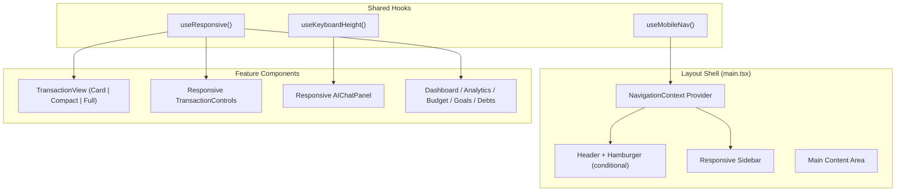

# Design Document: Responsive Design Overhaul

## Overview

This design transforms the Money Mind client from a desktop-only layout into a fully responsive application supporting mobile (<600px), tablet (600–959px), and desktop (≥960px) viewports. The overhaul introduces a responsive layout shell with drawer-based mobile navigation, viewport-adaptive transaction rendering, responsive AI chat, consistent design token usage, and WCAG 2.1 AA accessibility compliance.

**Key Design Decisions:**

1. **MUI-first responsive approach** — leverage `useMediaQuery`, the `sx` prop responsive syntax (`{ xs: ..., sm: ..., md: ... }`), and MUI's `Drawer` variant switching rather than custom CSS media queries or Tailwind breakpoints.
2. **Context-driven sidebar state** — a new `NavigationContext` manages drawer open/close state, collapsed preference, and viewport-aware mode switching.
3. **Component-level responsive adaptation** — transaction table renders different component trees per viewport (cards vs. compact table vs. full table) using conditional rendering rather than CSS show/hide to avoid shipping unused DOM.
4. **Design token enforcement** — replace all hardcoded values with theme references; use `unit()` helper from `src/shared/theme/spacing.ts` for all spacing values and `theme.palette.*` for all colors. Never use raw pixel values or hex codes in components.
5. **Named layout constants** — sidebar widths, drawer widths, padding scales defined as named constants in a central location so future additions (new sidebar items, new filter controls) don't require magic numbers.
6. **Extensible component architecture** — navigation items, filter controls, and page layouts are data-driven (configured via arrays/objects) so adding new items requires only a config change, not structural code modifications.

## Architecture

### High-Level System Diagram



### Layout Modes

| Viewport           | Sidebar Mode                                        | Content Width            | Padding        |
| ------------------ | --------------------------------------------------- | ------------------------ | -------------- |
| Mobile (<600px)    | Temporary Drawer (hidden, 280px overlay)            | 100% viewport            | `unit(4)` 16px |
| Tablet (600–959px) | Temporary Drawer (hidden, 280px overlay)            | 100% viewport            | `unit(5)` 20px |
| Desktop (≥960px)   | Permanent Drawer (100px collapsed / 240px expanded) | viewport − sidebar width | `unit(6)` 24px |

### Layout Constants

All layout dimensions defined as named constants in `src/shared/constants/layout.ts`:

```typescript
import { unitless } from '../theme/spacing'

export const LAYOUT = {
  sidebar: {
    expandedWidth: unitless(60), // 240px
    collapsedWidth: unitless(25), // 100px
    mobileWidth: unitless(70), // 280px
  },
  padding: {
    mobile: unitless(4), // 16px
    tablet: unitless(5), // 20px
    desktop: unitless(6), // 24px
  },
  header: {
    height: unitless(16), // 64px
  },
  transition: {
    duration: '0.3s',
    easing: 'ease',
  },
} as const
```

## Components and Interfaces

### New Shared Hooks

#### `useResponsive`

Returns the current viewport tier and boolean helpers for conditional logic.

```typescript
type ViewportTier = 'mobile' | 'tablet' | 'desktop'

type UseResponsiveReturn = {
  tier: ViewportTier
  isMobile: boolean
  isTablet: boolean
  isDesktop: boolean
  isTouch: boolean // mobile OR tablet
}

const useResponsive = (): UseResponsiveReturn => {
  const theme = useTheme()
  const isMobile = useMediaQuery(theme.breakpoints.down('sm'))
  const isTablet = useMediaQuery(theme.breakpoints.between('sm', 'md'))
  const isDesktop = useMediaQuery(theme.breakpoints.up('md'))

  const tier: ViewportTier = isMobile ? 'mobile' : isTablet ? 'tablet' : 'desktop'

  return { tier, isMobile, isTablet, isDesktop, isTouch: isMobile || isTablet }
}
```

#### `useMobileNav`

Manages mobile navigation drawer state with viewport-aware auto-dismiss.

```typescript
type UseMobileNavReturn = {
  isOpen: boolean
  open: () => void
  close: () => void
  toggle: () => void
}
```

#### `useKeyboardHeight`

Uses the `visualViewport` API to detect on-screen keyboard height for mobile chat UX.

```typescript
type UseKeyboardHeightReturn = {
  keyboardHeight: number
  isKeyboardVisible: boolean
}
```

### NavigationContext

Replaces the current local `collapsed` state in `Sidebar.tsx` with a shared context.

```typescript
type NavigationState = {
  isDrawerOpen: boolean // temporary drawer open/close (mobile/tablet)
  isCollapsed: boolean // permanent drawer collapsed/expanded (desktop)
  drawerMode: 'temporary' | 'permanent'
  openDrawer: () => void
  closeDrawer: () => void
  toggleCollapse: () => void
}
```

### Modified Layout Shell (`main.tsx`)

```typescript
import { unit } from '../shared/theme/spacing'
import { LAYOUT } from '../shared/constants/layout'

// Pseudocode for responsive layout
const Layout = () => {
  const { isTouch } = useResponsive()

  return (
    <NavigationProvider>
      <Box sx={{ display: 'flex' }}>
        <ResponsiveSidebar />
        <Box
          component="main"
          sx={{
            flexGrow: 1,
            minHeight: '100vh',
            width: { xs: '100%', md: 'auto' },
            px: {
              xs: unit(LAYOUT.padding.mobile / 4),  // unit(4) = 16px
              sm: unit(LAYOUT.padding.tablet / 4),  // unit(5) = 20px
              md: unit(LAYOUT.padding.desktop / 4), // unit(6) = 24px
            },
            overflow: 'hidden',
            transition: `padding ${LAYOUT.transition.duration} ${LAYOUT.transition.easing}`,
          }}
        >
          <ResponsiveHeader />
          <Outlet context={{ setHeader }} />
        </Box>
      </Box>
    </NavigationProvider>
  )
}
```

### ResponsiveSidebar Component

The sidebar renders two MUI `Drawer` variants conditionally. All widths reference `LAYOUT` constants:

```typescript
import { LAYOUT } from '../shared/constants/layout'

const ResponsiveSidebar = () => {
  const { drawerMode, isDrawerOpen, closeDrawer, isCollapsed, toggleCollapse } = useNavigation()

  if (drawerMode === 'temporary') {
    return (
      <Drawer
        variant="temporary"
        open={isDrawerOpen}
        onClose={closeDrawer}
        ModalProps={{ keepMounted: true }} // Better mobile performance
        sx={{
          '& .MuiDrawer-paper': { width: LAYOUT.sidebar.mobileWidth },
        }}
      >
        <SidebarContent onNavItemClick={closeDrawer} />
      </Drawer>
    )
  }

  const drawerWidth = isCollapsed ? LAYOUT.sidebar.collapsedWidth : LAYOUT.sidebar.expandedWidth

  return (
    <Drawer
      variant="permanent"
      sx={{
        width: drawerWidth,
        '& .MuiDrawer-paper': {
          width: drawerWidth,
          transition: `width ${LAYOUT.transition.duration} ${LAYOUT.transition.easing}`,
        },
      }}
    >
      <SidebarContent />
    </Drawer>
  )
}
```

### TransactionCardView (Mobile)

New component for mobile transaction rendering. Uses `unit()` for spacing, `theme.palette` for colors:

```typescript
import { unit } from '../../../shared/theme/spacing'

type TransactionCardProps = {
  transaction: ITransactionLogs
  isExpanded: boolean
  onToggle: () => void
}

const TransactionCard = ({ transaction, isExpanded, onToggle }: TransactionCardProps) => (
  <Card
    elevation={1}
    onClick={onToggle}
    sx={{ mb: unit(2), borderRadius: theme => theme.shape.borderRadius }}
  >
    <CardContent sx={{ p: unit(3) }}>
      {/* Summary: always visible */}
      <Box sx={{ display: 'flex', justifyContent: 'space-between', alignItems: 'center', gap: unit(2) }}>
        <Box sx={{ flex: 1, minWidth: 0 }}>
          <Typography variant="caption" color="text.secondary">
            {formatDate(transaction.transactionDate)}
          </Typography>
          <Typography
            variant="body2"
            sx={{
              overflow: 'hidden',
              textOverflow: 'ellipsis',
              display: '-webkit-box',
              WebkitLineClamp: 2,
              WebkitBoxOrient: 'vertical',
            }}
          >
            {transaction.narration}
          </Typography>
        </Box>
        <Typography
          variant="body1"
          fontWeight="bold"
          color={transaction.isCredit ? 'success.main' : 'error.main'}
        >
          ₹{Number(transaction.amount).toFixed(2)}
        </Typography>
      </Box>

      {/* Expanded details */}
      <Collapse in={isExpanded}>
        <Divider sx={{ my: unit(2) }} />
        {/* notes, category, labels, bank, group */}
      </Collapse>
    </CardContent>
  </Card>
)
```

### TransactionView Orchestrator

Selects the appropriate rendering mode:

```typescript
const TransactionView = (props: TransactionViewProps) => {
  const { tier } = useResponsive()

  switch (tier) {
    case 'mobile':
      return <TransactionCardList {...props} />
    case 'tablet':
      return <TransactionCompactTable {...props} />
    case 'desktop':
      return <CustomTable {...props} type="full" />
  }
}
```

### Responsive TransactionControls

Uses responsive `sx` prop with `unit()` for spacing to switch between stacked and horizontal layout:

```typescript
import { unit } from '../../../shared/theme/spacing'

<Box
  sx={{
    display: 'flex',
    flexDirection: { xs: 'column', md: 'row' },
    flexWrap: 'wrap',
    gap: unit(2), // 8px consistent gap
    '& > *': {
      flex: { xs: '1 1 100%', sm: '1 1 100%', md: '0 1 auto' },
      minWidth: { xs: '100%', md: 'auto' },
    },
  }}
>
  {/* controls */}
</Box>
```

### Responsive AI Chat Panel

Key mobile adaptations using `unit()` for spacing:

```typescript
import { unit } from '../../../shared/theme/spacing'

const AIChatPanel = () => {
  const { isMobile, isTablet } = useResponsive()
  const { keyboardHeight, isKeyboardVisible } = useKeyboardHeight()

  const bubbleMaxWidth = isMobile ? '85%' : isTablet ? '75%' : '70%'
  const messageAreaHeight = isKeyboardVisible
    ? `calc(100dvh - ${keyboardHeight}px - ${unit(20)})` // unit(20) = 80px for input area
    : '100%'

  return (
    <Box sx={{ display: 'flex', flexDirection: 'column', height: '100%', px: { xs: unit(2), sm: unit(4) } }}>
      <Box sx={{ flex: 1, overflowY: 'auto', maxHeight: messageAreaHeight, minHeight: unit(30) }}>
        {/* messages with maxWidth: bubbleMaxWidth */}
      </Box>
      <Box sx={{ position: 'sticky', bottom: 0, borderTop: 1, borderColor: 'divider', p: { xs: unit(2), sm: unit(4) } }}>
        {/* input area */}
      </Box>
    </Box>
  )
}
```

### Responsive Modals

MUI Dialog with responsive width:

```typescript
<Dialog
  open={open}
  onClose={handleClose}
  fullWidth
  maxWidth="sm"
  sx={{
    '& .MuiDialog-paper': {
      width: { xs: '95%', md: 'auto' },
      maxWidth: { xs: 500, md: 600 },
      mx: 'auto',
    },
  }}
>
  <Box sx={{ display: 'flex', flexDirection: { xs: 'column', md: 'row' }, gap: 2 }}>
    {/* form fields */}
  </Box>
</Dialog>
```

### Responsive Page Layouts

Pattern for Dashboard/Analytics/Budget/Goals/Debts using `unit()` for gap spacing:

```typescript
import { unit } from '../../../shared/theme/spacing'

// Grid layout that adapts per viewport
<Box
  sx={{
    display: 'grid',
    gridTemplateColumns: { xs: '1fr', sm: '1fr 1fr', md: '1fr 1fr 1fr' },
    gap: { xs: unit(4), sm: unit(5), md: unit(6) }, // 16px, 20px, 24px
  }}
>
  {/* chart/card components wrapped in ResponsiveContainer */}
</Box>
```

## Data Models

### NavigationState (Context)

```typescript
type DrawerMode = 'temporary' | 'permanent'

type NavigationState = {
  isDrawerOpen: boolean
  isCollapsed: boolean
  drawerMode: DrawerMode
}

type NavigationActions = {
  openDrawer: () => void
  closeDrawer: () => void
  toggleCollapse: () => void
}

type NavigationContextValue = NavigationState & NavigationActions
```

### ViewportTier (Hook Return)

```typescript
type ViewportTier = 'mobile' | 'tablet' | 'desktop'

type ResponsiveInfo = {
  tier: ViewportTier
  isMobile: boolean
  isTablet: boolean
  isDesktop: boolean
  isTouch: boolean
}
```

### TransactionCardState

```typescript
type TransactionCardListState = {
  expandedId: string | null // Only one card expanded at a time
}
```

### DesignTokens (Extended Theme)

No new data model needed — tokens already exist in `colors.ts`, `spacing.ts`, `typography.ts`, `breakpoints.ts`, `shadows.ts`. The work involves:

1. **Spacing**: Always use `unit(n)` for CSS string values and `unitless(n)` for numeric px values. Never write raw pixel numbers.
2. **Colors**: Always access via `theme.palette.*` (using `useTheme()` hook or `sx` color shortcuts like `'success.main'`). Never hardcode hex/rgb values in components.
3. **Typography**: Use MUI theme typography variants (`variant="body1"`, `variant="h6"`) which reference the centralized `fontSize` and `fontWeight` scales. Never use raw `fontSize` in `sx`.
4. **Border radius**: Use `theme.shape.borderRadius` or `borderRadius.*` from the theme scale. Never hardcode radius values.
5. **Breakpoints**: Use `theme.breakpoints.up/down/between` or `sx` responsive object syntax `{ xs: ..., sm: ..., md: ... }`. Never use raw `@media` queries with pixel values.

### Layout Constants (New File)

A new `src/shared/constants/layout.ts` defines all layout-level dimensions as named constants derived from the spacing system. This ensures:

- Adding a new sidebar item won't break anything (widths are centralized)
- Changing padding requires editing one file
- Future developers understand intent without reverse-engineering pixel values

### Sidebar Navigation Item (Refactored)

```typescript
type NavItem = {
  label: string
  icon: ReactNode
  path: string
  variant?: 'default' | 'danger' // 'danger' for logout styling
}

const navItems: NavItem[] = [
  { label: 'Dashboard', icon: <Dashboard />, path: '/' },
  // ...existing items
  { label: 'Logout', icon: <Logout />, variant: 'danger', path: '#logout' },
]
```

## Correctness Properties

_A property is a characteristic or behavior that should hold true across all valid executions of a system — essentially, a formal statement about what the system should do. Properties serve as the bridge between human-readable specifications and machine-verifiable correctness guarantees._

### Property 1: Transaction card summary displays required fields

_For any_ valid transaction object (with any combination of date, narration, amount, and type values), rendering it in the mobile card summary view SHALL produce output containing all four required fields: formatted date, narration text, amount value, and transaction type indicator.

**Validates: Requirements 3.1**

### Property 2: Expanded card reveals all non-empty optional fields

_For any_ valid transaction object with one or more populated optional fields (notes, category, labels, bankName, group), when the card is expanded, all non-empty optional fields SHALL be present in the rendered expanded section.

**Validates: Requirements 3.4**

### Property 3: Amount color-coding matches credit/debit status

_For any_ transaction object, the rendered amount text color SHALL equal the theme's `success.main` color when `isCredit` is true, and the theme's `error.main` color when `isCredit` is false, regardless of the numeric amount value.

**Validates: Requirements 3.7**

### Property 4: Single card expansion invariant

_For any_ sequence of card tap interactions on the mobile transaction card list, after each tap event the number of cards in the "expanded" state SHALL be at most 1, and if a card was tapped that was not already expanded, it SHALL be the only expanded card.

**Validates: Requirements 3.9**

### Property 5: Chat bubble max-width matches viewport tier

_For any_ chat message rendered at a given viewport width, the message bubble's `maxWidth` style SHALL equal 85% when viewport < 600px, 75% when viewport is 600–959px, and 70% when viewport ≥ 960px.

**Validates: Requirements 5.2**

### Property 6: Minimum message area height with keyboard

_For any_ keyboard height value between 0px and the full viewport height minus 200px, the computed message area height SHALL be at least 120px, ensuring the chat remains usable with any on-screen keyboard size.

**Validates: Requirements 5.4**

### Property 7: Theme color contrast meets WCAG AA

_For any_ text color and background color pair defined in the application's theme token system (`colors.ts` light and dark palettes), the computed contrast ratio SHALL be at least 4.5:1 for normal text usage and at least 3:1 for large text usage.

**Validates: Requirements 7.4**

### Property 8: Touch target minimum size

_For any_ interactive element (buttons, icon buttons, links, form controls) rendered on a mobile or tablet viewport, the computed clickable area SHALL have a minimum width of 44px and minimum height of 44px.

**Validates: Requirements 4.5, 7.5**

## Error Handling

### Navigation Errors

| Scenario | Handling |
| --- | --- |
| `useMediaQuery` returns inconsistent values during SSR/hydration | Default to mobile tier; use `noSsr: true` option on `useMediaQuery` to avoid hydration mismatch |
| `visualViewport` API not supported (older browsers) | `useKeyboardHeight` hook returns `{ keyboardHeight: 0, isKeyboardVisible: false }` — chat panel uses full height as fallback |
| Navigation context consumed outside provider | Throw descriptive error: "useNavigation must be used within NavigationProvider" |

### Data Rendering Errors

| Scenario | Handling |
| --- | --- |
| Transaction with missing/null fields in card view | Render available fields; use `'—'` placeholder for missing date/narration; amount defaults to `₹0.00` |
| Empty transaction list on mobile | Render centered empty state illustration with "No transactions yet" message |
| Chart data fails to load | Show skeleton placeholders with retry button; log error to console |

### Layout Errors

| Scenario | Handling |
| --- | --- |
| Content overflow on narrow viewports (320px) | `overflow-x: hidden` on root, `word-break: break-word` on text content, responsive images via `max-width: 100%` |
| Sidebar mode mismatch during rapid resize | Debounce viewport transitions; `useMediaQuery` handles this natively via `matchMedia` events |
| Modal overflow on small screens | Enable `overflow-y: auto` on dialog content; constrain max-height to `90vh` |

### Accessibility Errors

| Scenario | Handling |
| --- | --- |
| Focus trap escape in modals | MUI Dialog handles focus trap natively; ensure `disablePortal` is not used |
| Screen reader announcement for drawer state changes | Use `aria-expanded` on hamburger, `aria-hidden` on drawer when closed |
| Keyboard navigation skips elements | Ensure no `tabIndex={-1}` on interactive elements unless explicitly managing focus |

## Testing Strategy

### Unit Tests (Example-Based)

Focus on specific scenarios and integration points:

- **Layout Shell**: Verify correct padding at each breakpoint (320px, 600px, 960px, 1280px)
- **Responsive Sidebar**: Test drawer variant switching (temporary vs. permanent) at breakpoints
- **Header**: Hamburger button rendering conditional on viewport, truncation styles
- **Transaction Controls**: Stacking behavior at mobile, wrapping at tablet, horizontal at desktop
- **Modal responsiveness**: Width and stacking at mobile vs. desktop
- **Page layouts**: Grid column count at each breakpoint
- **Accessibility**: ARIA attributes on drawer, hamburger, expandable cards
- **Skeleton/empty states**: Correct placeholders rendered during loading/empty states

### Property-Based Tests (Universal Properties)

Using **fast-check** (already in devDependencies) with **vitest** as the test runner.

Configuration:

- Minimum 100 iterations per property test
- Each test tagged with property reference comment

**Test file structure**: `src/shared/__tests__/responsive.property.test.ts`

Properties to implement:

1. Transaction card field visibility (Property 1)
2. Expanded card optional field visibility (Property 2)
3. Amount color mapping (Property 3)
4. Single expansion invariant (Property 4)
5. Chat bubble max-width per tier (Property 5)
6. Minimum message area height (Property 6)
7. Theme contrast ratios (Property 7)
8. Touch target minimums (Property 8)

**Tag format example:**

```typescript
// Feature: responsive-design-overhaul, Property 3: Amount color-coding matches credit/debit status
```

### Integration Tests

- Sidebar open/close lifecycle with navigation item click
- Viewport resize triggering mode switches
- Filter drawer behavior across viewports
- Full page render at 320px (minimum supported width)

### Accessibility Audits

- axe-core automated checks on key pages at each viewport
- Manual screen reader testing (VoiceOver/NVDA) for drawer and expandable card interactions
- Keyboard-only navigation flow testing

### Visual Regression (Manual/Future)

- Snapshot comparisons at 320px, 600px, 960px, 1280px for key pages
- Dark mode + light mode at each breakpoint
- Skeleton and empty states visual verification
