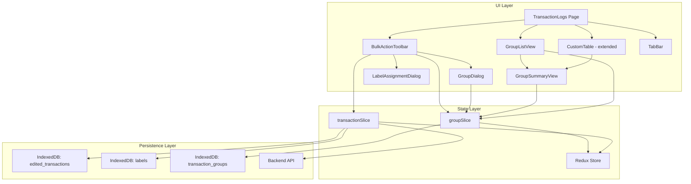

# Design Document: Transaction Grouping

## Overview

This feature adds bulk actions and transaction grouping to the Transaction Logs page. Users can select multiple transactions and perform bulk label assignment, create named groups for settlement/debt/lending tracking, or add transactions to existing groups. Each group calculates financial summaries (debits, credits, net settlement, status) and surfaces group membership in the transaction table via badges and info icons. A tab system on the Transactions page lets users switch between "All Transactions" and "Grouped Transactions" views.

The design extends the existing React + TypeScript + MUI + Redux Toolkit + IndexedDB (`idb`) stack. New state lives in a `groupSlice`, new persistence lives in a `transaction_groups` IndexedDB object store, and new UI components slot into the existing `TransactionLogs` page layout.

## Architecture



### Key Architectural Decisions

1. **Groups are local-only (IndexedDB)** — consistent with the existing local-edit pattern. The `transaction_groups` store is independent from `edited_transactions`, so group CRUD never interferes with transaction sync.

2. **Groups reference transactions by ID** — a Group stores an array of `transactionId` strings. The actual transaction data is resolved at render time from the Redux `transactions` state. This avoids data duplication and keeps groups lightweight.

3. **Group summary is computed, not stored** — debit/credit totals, net settlement, and status are derived from the referenced transactions at display time. This avoids stale cached values when transactions are edited.

4. **Tab-based navigation** — MUI `Tabs` component switches between the existing "All Transactions" view and the new "Grouped Transactions" view within the same page, avoiding new routes.

5. **Selection state is local to TransactionLogs** — `selectedIds` remains a `useState` array in `TransactionLogs.tsx`, not Redux. This keeps selection ephemeral and automatically resets on unmount.

6. **Per-member expense splitting** — Each group stores a `members: IMember[]` array where each member has `name`, `share` (what they owe), `paid` (what they've returned), and optional `percentage`. Net per member = `paid - share`. Positive means the user owes them (they overpaid), negative means they still owe the user.

7. **Multiple split types** — Groups support 6 split types via `SplitType` enum: Equal (payer included/excluded), Custom Amounts, Percentage, Loan/Lending, and Itemized. Split calculations are pure functions in `splitCalculations.ts`.

8. **Member suggestions from existing groups** — GroupDialog extracts unique member names from all existing groups + the logged-in user for autocomplete suggestions. No separate member API — suggestions are derived locally.

9. **Settlement optimization** — A greedy algorithm in `calculateSettlements()` minimizes the number of transactions needed to settle a group by matching largest debtors with largest creditors.

## Components and Interfaces

### New Components

#### `BulkActionToolbar`

- **Location:** `src/components/BulkActionToolbar.tsx`
- **Props:**
  ```typescript
  interface BulkActionToolbarProps {
    selectedIds: string[]
    onClearSelection: () => void
    onAttachToLogs: () => void
    onCreateGroup: () => void
    onAddToGroup: (groupId: string) => void
    groupsExist: boolean
  }
  ```
- **Behavior:** Renders between `TransactionControls` and `CustomTable` when `selectedIds.length > 0`. Shows count, "Clear Selection" button, "Attach to Logs" button, "Create Group" button (disabled when `selectedIds.length < 2`), and "Add to Group" dropdown (visible only when `groupsExist` is true).

#### `LabelAssignmentDialog`

- **Location:** `src/components/LabelAssignmentDialog.tsx`
- **Props:**
  ```typescript
  interface LabelAssignmentDialogProps {
    open: boolean
    onClose: () => void
    onConfirm: (labels: string[]) => void
    availableLabels: string[]
  }
  ```
- **Behavior:** Wraps `CustomModal`. Contains a multi-select `Autocomplete` with `freeSolo` for label selection. On confirm, passes selected labels back. On close without confirm, no-ops.

#### `GroupDialog`

- **Location:** `src/components/GroupDialog.tsx`
- **Props:**
  ```typescript
  interface GroupDialogProps {
    open: boolean
    onClose: () => void
    onSubmit: (data: {
      name: string
      involvedParty: string
      members: IMember[]
      notes: string
      splitType: SplitType
    }) => void
    initialData?: { name: string; involvedParty: string; members: IMember[]; notes: string; splitType?: SplitType }
    mode: 'create' | 'edit'
    transactions: ITransactionLogs[]
  }
  ```
- **Behavior:** Wraps `CustomModal`. Features split type selection dropdown, auto-calculate shares button, dynamic member rows with Autocomplete name fields (suggestions from existing groups + logged-in user), paid/share/percentage fields per member, real-time net calculation chips, total paid vs total shares summary, and validation warnings. In create mode, auto-populates logged-in user as first member with total debits as paid amount. In edit mode, pre-populates all fields. The `involvedParty` string is auto-generated from member names.

#### `GroupSummaryView`

- **Location:** `src/components/GroupSummaryView.tsx`
- **Props:**
  ```typescript
  interface GroupSummaryViewProps {
    group: ITransactionGroup
    transactions: ITransactionLogs[]
    onRemoveTransaction: (transactionId: string) => void
    onEditGroup: () => void
    onDeleteGroup: () => void
    onClose: () => void
  }
  ```
- **Behavior:** Renders as a `CustomModal`. Displays group metadata, split type badge, settlement suggestions (who should pay whom), per-member settlement breakdown (name, share, paid, net with color-coded chips), computed summary (total debits, total credits, net settlement, status), and a list of member transactions with remove actions. Shows "Transaction not found" for missing transaction IDs. Edit button closes summary and opens GroupDialog. Delete with confirmation.

#### `GroupListView`

- **Location:** `src/components/GroupListView.tsx`
- **Props:**
  ```typescript
  interface GroupListViewProps {
    groups: ITransactionGroup[]
    transactions: ITransactionLogs[]
    onGroupClick: (groupId: string) => void
    onDeleteGroup: (groupId: string) => void
  }
  ```
- **Behavior:** Renders a table of all groups with name, member count, transaction count, net settlement amount, and status. Supports sorting by name, status, or net amount. Each row is clickable to open `GroupSummaryView`. Delete action per row with confirmation.

### Modified Components

#### `CustomTable` (Table.tsx)

- **New columns:** "Group" column showing `Group_Badge` chips (MUI `Chip`) and `Group_Info_Icon` (`InfoOutlined`).
- **New props added:**
  ```typescript
  // Added to existing Props type
  groups?: ITransactionGroup[];
  onGroupBadgeClick?: (groupId: string) => void;
  onGroupInfoClick?: (event: React.MouseEvent, transactionId: string) => void;
  ```
- **Badge overflow:** Shows first 2 group chips, then "+N" for additional groups — consistent with existing label overflow pattern.

#### `TransactionLogs` (TransactionLogs.tsx)

- **Tab bar:** MUI `Tabs` at the top with "All Transactions" (default) and "Grouped Transactions".
- **Bulk action toolbar:** Rendered between `TransactionControls` and `CustomTable` when `selectedIds.length > 0` and "All Transactions" tab is active.
- **Selection reset:** `selectedIds` cleared on `page`, `filters`, or `limit` changes via a `useEffect`.
- **Group dialogs:** State management for opening/closing `GroupDialog`, `LabelAssignmentDialog`, and `GroupSummaryView`.

### Utility Functions

#### `computeGroupSummary`

- **Location:** `src/utils/groupUtils.ts`
- **Signature:**

  ```typescript
  interface MemberSettlement {
    name: string
    share: number
    paid: number
    net: number // paid - share: positive = you owe them, negative = they owe you
  }

  interface GroupSummary {
    totalDebits: number
    totalCredits: number
    netSettlement: number
    status: 'Settled' | 'Unsettled'
    memberSettlements: MemberSettlement[]
  }

  function computeGroupSummary(group: ITransactionGroup, transactions: ITransactionLogs[]): GroupSummary
  ```

- **Logic:** Filters `transactions` to those whose `_id` is in `group.transactionIds`. Sums `amount` (parsed as number) for credit vs debit transactions. Net = totalCredits - totalDebits. Computes per-member settlement from `group.members`. Status = "Settled" when all members have net === 0 (or no members and net === 0).

#### `calculateShares`

- **Location:** `src/utils/splitCalculations.ts`
- **Signature:**
  ```typescript
  function calculateShares(members: IMember[], splitType: SplitType, totalAmount: number): IMember[]
  ```
- **Logic:** Returns updated members with calculated share values based on split type. Equal splits divide evenly, percentage splits use member percentages, loan splits set lender share to 0 and borrower share to total.

#### `calculateSettlements`

- **Location:** `src/utils/splitCalculations.ts`
- **Signature:**
  ```typescript
  interface SettlementSuggestion {
    from: string
    to: string
    amount: number
  }
  function calculateSettlements(members: IMember[]): SettlementSuggestion[]
  ```
- **Logic:** Greedy algorithm matching largest debtors with largest creditors to minimize number of settlement transactions.

#### `mergeLabels`

- **Location:** `src/utils/groupUtils.ts`
- **Signature:**
  ```typescript
  function mergeLabels(existing: string[], incoming: string[]): string[]
  ```
- **Logic:** Returns `Array.from(new Set([...existing, ...incoming]))`. Used by bulk label assignment to merge without duplicates.

## Data Models

### `ITransactionGroup` (new type)

```typescript
// src/store/groupSlice.ts

interface IMember {
  name: string // Member name
  share: number // How much they owe from the total
  paid: number // How much they've actually paid back
  percentage?: number // For percentage-based splits
}

interface ITransactionGroup {
  id: string // UUID, generated via crypto.randomUUID()
  name: string // Required, non-empty
  involvedParty: string // Auto-generated comma-separated member names
  members: IMember[] // Per-member share and payment tracking
  notes: string // Optional free-text
  transactionIds: string[] // References to ITransactionLogs._id
  createdAt: string // ISO 8601 timestamp
  updatedAt: string // ISO 8601 timestamp
  splitType?: SplitType // Optional for backward compatibility
  splitConfig?: SplitConfiguration // Additional configuration for split
}
```

### IndexedDB Schema Extension

The existing `ExpenseTrackerDB` database version is bumped to `5`. The `upgrade` handler in `db.ts` adds a new `transaction_groups` object store:

```typescript
// Updated db.ts schema
interface ExpenseDB extends DBSchema {
  edited_transactions: {
    key: string
    value: Partial<ITransactionLogs>
  }
  labels: {
    key: string
    value: { key: string; labels: string[] }
  }
  transaction_groups: {
    key: string
    value: ITransactionGroup
  }
}
```

The `initDB` upgrade function:

```typescript
export function initDB(): Promise<IDBPDatabase<ExpenseDB>> {
  if (dbPromise === undefined) {
    dbPromise = openDB<ExpenseDB>('ExpenseTrackerDB', 5, {
      upgrade(db) {
        if (!db.objectStoreNames.contains('edited_transactions')) {
          db.createObjectStore('edited_transactions', { keyPath: '_id' })
        }
        if (!db.objectStoreNames.contains('labels')) {
          db.createObjectStore('labels', { keyPath: 'key' })
        }
        if (!db.objectStoreNames.contains('transaction_groups')) {
          db.createObjectStore('transaction_groups', { keyPath: 'id' })
        }
      },
    }).catch(err => {
      dbPromise = undefined
      throw err
    })
  }
  return dbPromise
}
```

### `groupStore.ts` (new IndexedDB helper)

```typescript
// src/helpers/indexDB/groupStore.ts

class GroupStore {
  async saveGroup(group: ITransactionGroup): Promise<void>
  async getAllGroups(): Promise<ITransactionGroup[]>
  async getGroup(id: string): Promise<ITransactionGroup | undefined>
  async deleteGroup(id: string): Promise<void>
}
```

Follows the same pattern as `IndexDBTransactions` — gets the DB via `initDB()`, performs operations on the `transaction_groups` store.

### Redux State: `groupSlice`

```typescript
// src/store/groupSlice.ts

interface IGroupState {
  groups: ITransactionGroup[]
  loading: boolean
  error: string | null
}

const initialState: IGroupState = {
  groups: [],
  loading: false,
  error: null,
}
```

**Actions:**

- `loadGroups` — async thunk: reads all groups from `GroupStore`, populates state
- `createGroup` — async thunk: saves to `GroupStore`, adds to state
- `updateGroup` — async thunk: updates in `GroupStore`, updates in state
- `deleteGroup` — async thunk: removes from `GroupStore`, removes from state
- `addTransactionsToGroup` — async thunk: appends transaction IDs (deduped), updates `GroupStore` and state
- `removeTransactionFromGroup` — async thunk: removes a transaction ID, updates `GroupStore` and state

**Store registration** in `src/store/index.ts`:

```typescript
import groupReducer from './groupSlice'

export const store = configureStore({
  reducer: {
    auth: authReducer,
    transactions: transactionReducer,
    groups: groupReducer,
  },
})
```

### Transaction-to-Group Lookup

To efficiently render group badges on transaction rows, a derived lookup map is computed via a selector:

```typescript
// Selector in groupSlice.ts or a selectors file
const selectTransactionGroupMap = createSelector(
  [(state: RootState) => state.groups.groups],
  (groups): Record<string, ITransactionGroup[]> => {
    const map: Record<string, ITransactionGroup[]> = {}
    for (const group of groups) {
      for (const txId of group.transactionIds) {
        if (!map[txId]) map[txId] = []
        map[txId].push(group)
      }
    }
    return map
  }
)
```

This memoized selector avoids recomputing the map on every render unless `groups` changes.

## Correctness Properties

_A property is a characteristic or behavior that should hold true across all valid executions of a system — essentially, a formal statement about what the system should do. Properties serve as the bridge between human-readable specifications and machine-verifiable correctness guarantees._

### Property 1: Bulk toolbar displays correct selection count

_For any_ non-empty array of selected transaction IDs, the `BulkActionToolbar` should render and display a count equal to the length of that array.

**Validates: Requirements 1.1, 1.3**

### Property 2: Label merge preserves existing and adds new without duplicates

_For any_ existing label array and any incoming label array, `mergeLabels(existing, incoming)` should return an array that contains every element from both inputs exactly once, with no elements from `existing` removed.

**Validates: Requirements 2.3**

### Property 3: Create Group button enabled only when two or more selected

_For any_ array of selected transaction IDs, the "Create Group" button should be enabled if and only if the array length is >= 2.

**Validates: Requirements 3.1, 3.5**

### Property 4: Created group contains all selected transaction IDs

_For any_ valid group name, involved party, notes, and set of two or more transaction IDs, creating a group should produce a group object whose `transactionIds` contains exactly those IDs, whose `name` matches the input, and whose `id` is a non-empty unique string.

**Validates: Requirements 3.3**

### Property 5: Adding transactions to a group deduplicates

_For any_ existing group with transaction IDs and any set of new transaction IDs to add, the resulting `transactionIds` array should contain the union of both sets with no duplicate entries.

**Validates: Requirements 4.3, 4.4**

### Property 6: Group persistence round-trip

_For any_ valid `ITransactionGroup` object, saving it to the `GroupStore` and then retrieving it by ID should return an equivalent object with all fields (`id`, `name`, `involvedParty`, `notes`, `transactionIds`, `createdAt`, `updatedAt`) preserved.

**Validates: Requirements 5.1**

### Property 7: Group update sets updatedAt timestamp

_For any_ existing group, when its metadata or transaction list is updated, the `updatedAt` field of the stored group should be greater than or equal to the `updatedAt` value before the update.

**Validates: Requirements 5.3**

### Property 8: Group deletion removes record

_For any_ group that has been saved to the `GroupStore`, deleting it by ID and then attempting to retrieve it should return `undefined`.

**Validates: Requirements 5.4, 9.3**

### Property 9: Group summary computation

_For any_ group and any set of transactions (each with a numeric `amount` and boolean `isCredit`), `computeGroupSummary` should return `totalDebits` equal to the sum of amounts where `isCredit` is false, `totalCredits` equal to the sum of amounts where `isCredit` is true, and `netSettlement` equal to `totalCredits - totalDebits`.

**Validates: Requirements 6.1, 6.2**

### Property 10: Group status derivation

_For any_ group summary, the `status` field should be `"Settled"` if and only if `netSettlement` equals zero, and `"Unsettled"` otherwise.

**Validates: Requirements 6.4, 6.5**

### Property 11: Net settlement label by sign

_For any_ net settlement amount, a positive value should be labeled "Owed to you" and a negative value should be labeled "You owe".

**Validates: Requirements 6.6**

### Property 12: Remove transaction from group

_For any_ group containing a transaction ID, removing that ID should result in a group whose `transactionIds` no longer contains that ID, and whose remaining IDs are unchanged.

**Validates: Requirements 8.2**

### Property 13: Transaction-to-group lookup map

_For any_ set of groups, the `selectTransactionGroupMap` selector should produce a map where each transaction ID key maps to exactly the groups whose `transactionIds` include that ID, and transaction IDs not in any group should not appear as keys.

**Validates: Requirements 10.1, 10.4, 10.7**

### Property 14: Group badge overflow rendering

_For any_ transaction belonging to N groups (N >= 1), the rendered badges should show `min(N, 2)` group chips, and if N > 2, an additional "+{N-2}" indicator.

**Validates: Requirements 10.2**

### Property 15: Group list sorting

_For any_ list of groups and a chosen sort key (name, status, or net amount), the sorted result should be in the correct ascending order for that key.

**Validates: Requirements 11.3**

### Property 16: Group list item displays required fields

_For any_ group rendered in the `GroupListView`, the rendered output should contain the group's name, involved party, transaction count, net settlement amount, and status.

**Validates: Requirements 11.2, 12.5**

### Property 17: Bulk toolbar hidden on Grouped Transactions tab

_For any_ selection state (including non-empty `selectedIds`), when the active tab is "Grouped Transactions", the `BulkActionToolbar` should not be rendered.

**Validates: Requirements 12.7**

### Property 18: Group metadata edit round-trip

_For any_ existing group and any valid updated metadata (name, involvedParty, notes), updating the group and then retrieving it should reflect the new metadata values.

**Validates: Requirements 13.3**

### Property 19: Redux-IndexedDB sync after CRUD

_For any_ group CRUD operation (create, update, delete), the Redux `groups` state should match the complete set of groups in the `GroupStore`.

**Validates: Requirements 14.2**

### Property 20: Database migration preserves existing stores

_For any_ existing `ExpenseTrackerDB` at version 3 with data in `edited_transactions` and `labels`, upgrading to version 4 should create the `transaction_groups` store without losing data in the existing stores.

**Validates: Requirements 15.3**

### Property 21: Selection reset on navigation changes

_For any_ change in `page`, `filters`, or `limit` values, the `selectedIds` state should be reset to an empty array.

**Validates: Requirements 16.1**

## Error Handling

### Validation Errors

- **Empty group name:** `GroupDialog` prevents submission and shows inline error when name is empty or whitespace-only.
- **Empty label selection:** `LabelAssignmentDialog` closes without modifying transactions if no labels are selected.
- **Fewer than 2 transactions for group creation:** "Create Group" button is disabled; no error dialog needed.
- **Removing transaction below minimum:** When removal would leave < 2 transactions, show a confirmation dialog offering to delete the group instead.

### Data Integrity Errors

- **Missing transaction references:** When a group references a transaction ID that no longer exists in the Redux store (deleted or not on current page), `GroupSummaryView` shows "Transaction not found" with the ID. The group remains valid — missing references don't cause errors.
- **IndexedDB failures:** All `GroupStore` methods use try/catch. On failure, the async thunk rejects and the `groupSlice` sets `error` state. The UI can display an error snackbar via the existing `useSnackbar` hook.
- **Database migration failure:** If `initDB` fails during version upgrade, `dbPromise` is reset to `undefined` (existing pattern), and subsequent calls retry. The UI shows a loading/error state.

### Concurrency

- **Stale selection after page change:** The `useEffect` that resets `selectedIds` on `page`/`filters`/`limit` changes prevents acting on transactions no longer visible.
- **Concurrent group edits:** Since this is a single-user local app, concurrent edits are not a concern. IndexedDB transactions provide atomicity for individual operations.

## Testing Strategy

### Property-Based Testing

**Library:** [fast-check](https://github.com/dubzzz/fast-check) — the standard property-based testing library for TypeScript/JavaScript.

**Configuration:**

- Minimum 100 iterations per property test (`numRuns: 100`)
- Each test tagged with a comment referencing the design property:
  ```typescript
  // Feature: transaction-grouping, Property 9: Group summary computation
  ```

**Property tests cover:**

- `mergeLabels` (Property 2)
- `computeGroupSummary` (Properties 9, 10, 11)
- `GroupStore` CRUD round-trips (Properties 6, 7, 8, 18)
- `addTransactionsToGroup` deduplication (Property 5)
- `removeTransactionFromGroup` (Property 12)
- `selectTransactionGroupMap` selector (Property 13)
- Group badge overflow logic (Property 14)
- Group list sorting (Property 15)
- Redux-IndexedDB sync (Property 19)
- Selection reset behavior (Property 21)

### Unit Testing

Unit tests complement property tests by covering specific examples, edge cases, and UI interactions:

- **BulkActionToolbar:** Renders when `selectedIds` is non-empty, hides when empty. "Create Group" disabled when < 2 selected. "Add to Group" hidden when no groups exist.
- **LabelAssignmentDialog:** Opens/closes correctly. Confirms with labels. Cancels without changes. Confirms with empty selection.
- **GroupDialog:** Validates empty name. Pre-populates in edit mode. Submits valid data.
- **GroupSummaryView:** Displays "Transaction not found" for missing IDs. Shows edit/delete/remove actions.
- **GroupListView:** Renders all groups. Delete with confirmation.
- **Tab switching:** Default tab is "All Transactions". Switching tabs shows correct content.
- **Database migration:** Existing data preserved after version upgrade.

### Integration Testing

- Full flow: select transactions → create group → verify group in list → open summary → verify calculations → edit metadata → remove transaction → delete group.
- Bulk label assignment flow: select → attach labels → verify merge → verify persistence.
- Tab navigation: switch tabs, verify toolbar visibility, verify content.

### Test File Organization

```
src/
├── utils/__tests__/
│   └── groupUtils.test.ts          # Property tests for computeGroupSummary, mergeLabels, sorting
├── store/__tests__/
│   └── groupSlice.test.ts          # Property tests for Redux actions, selectors
├── helpers/indexDB/__tests__/
│   └── groupStore.test.ts          # Property tests for IndexedDB round-trips
└── components/__tests__/
    ├── BulkActionToolbar.test.tsx   # Unit + property tests for toolbar visibility/count
    ├── GroupDialog.test.tsx         # Unit tests for validation, pre-population
    ├── GroupSummaryView.test.tsx    # Unit tests for display, missing transactions
    ├── GroupListView.test.tsx       # Unit + property tests for rendering, sorting
    └── GroupBadge.test.tsx          # Property tests for badge overflow
```
